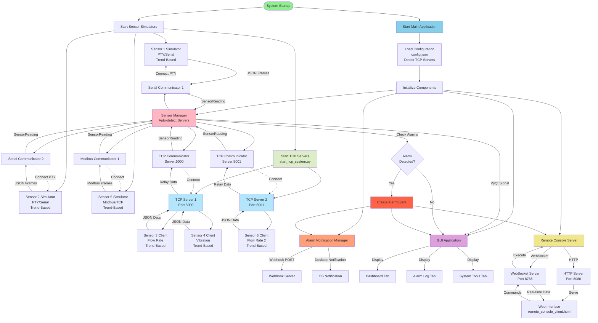
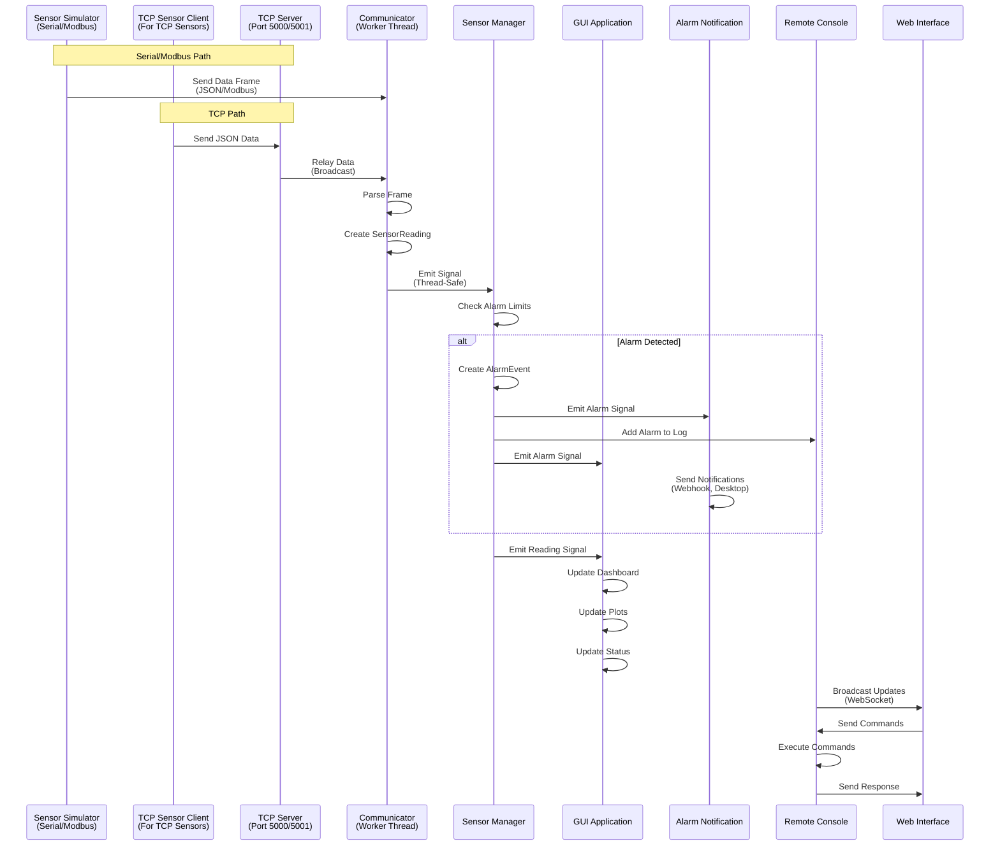
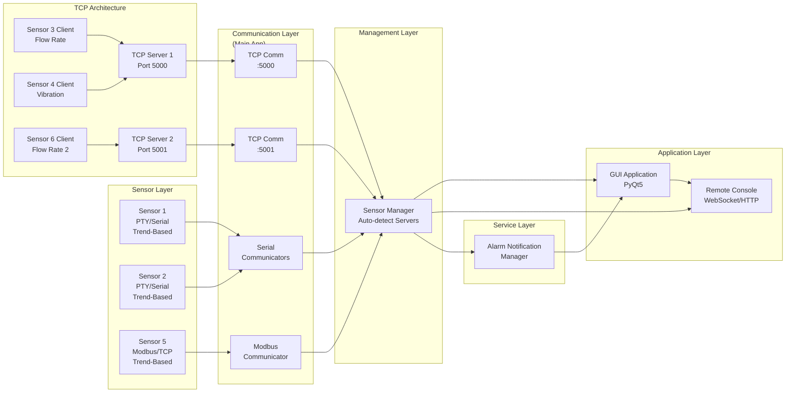
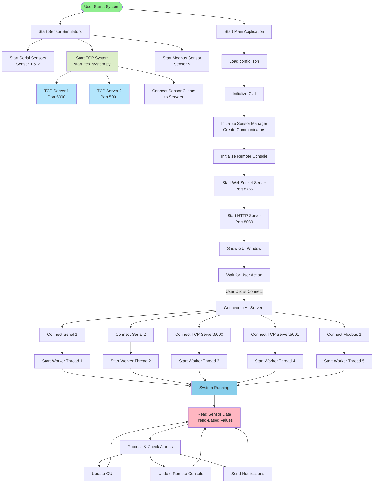
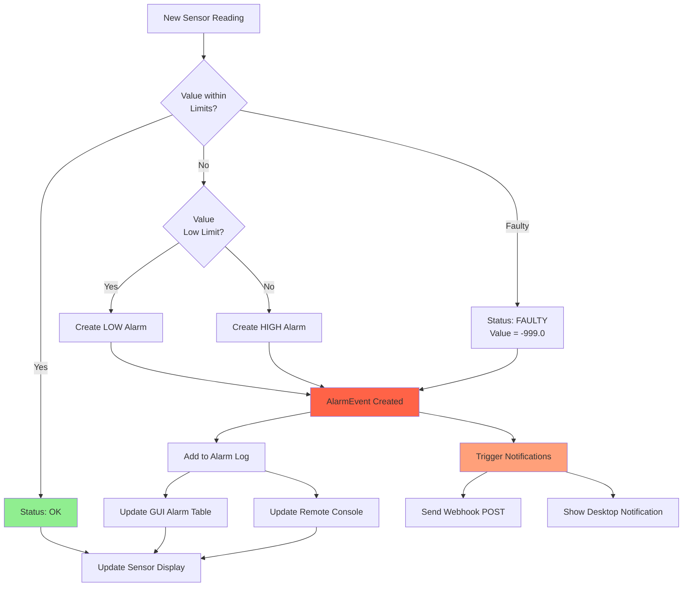
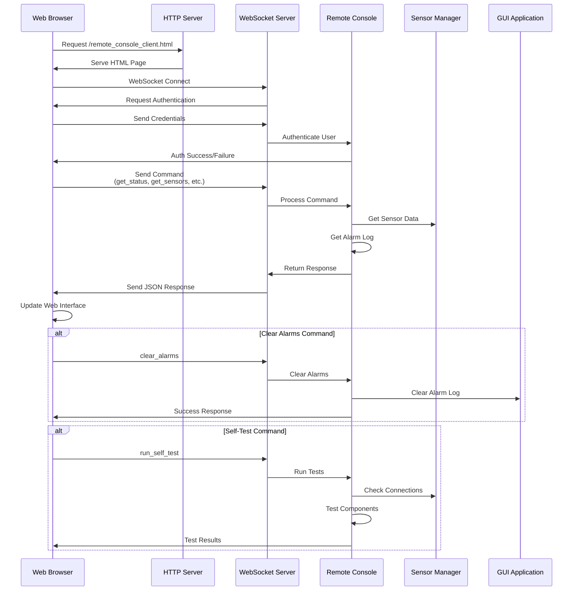
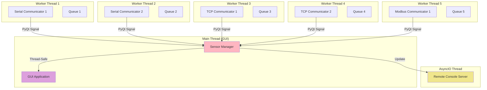

# Si-Ware Production Line Monitoring System - High-Level Flowchart

## Graphical Flowcharts

High-resolution PNG images have been generated with improved organization:

1. **SYSTEM_ARCHITECTURE.png** - Complete system architecture diagram with organized layers

   - Grouped components by function (Simulators, Communication, Management, GUI, Remote Console, Notifications)
   - Color-coded layers for easy identification
   - Clear data flow paths

2. **DATA_FLOW.png** - Data flow sequence diagram

   - Shows step-by-step data processing
   - Grouped by processing stages
   - Numbered flow steps

3. **STARTUP_SEQUENCE.png** - System startup flowchart
   - Phased startup process
   - Clear initialization steps
   - User interaction flow

These images show the visual representation of the system architecture with improved organization and clarity.

---

## System Architecture Flow (Mermaid Diagram)



## Data Flow Diagram



## Component Interaction Flow



## Startup Sequence



## Alarm Processing Flow



## Remote Console Command Flow



## Thread Architecture Flow



## ASCII Art Flowchart (Plain Text Version)

```
┌─────────────────────────────────────────────────────────────────┐
│                    SYSTEM STARTUP FLOW                          │
└─────────────────────────────────────────────────────────────────┘

    [User Starts Application]
            │
            ├───> Start Sensor Simulators
            │         │
            │         ├───> Sensor 1 (PTY) ────> /dev/pts/X
            │         ├───> Sensor 2 (PTY) ────> /dev/pts/Y
            │         ├───> Sensor 3 (TCP) ────> localhost:5000
            │         ├───> Sensor 4 (TCP) ────> localhost:5001
            │         └───> Sensor 5 (Modbus) ──> localhost:1502
            │
            └───> Start Main Application (main.py)
                      │
                      ├───> Load config.json
                      │
                      ├───> Initialize Sensor Manager
                      │         │
                      │         ├───> Serial Communicators
                      │         ├───> TCP Communicators
                      │         └───> Modbus Communicator
                      │
                      ├───> Initialize GUI (PyQt5)
                      │         │
                      │         ├───> Dashboard Tab
                      │         ├───> Alarm Log Tab
                      │         └───> System Tools Tab
                      │
                      ├───> Start Remote Console
                      │         │
                      │         ├───> WebSocket Server (Port 8765)
                      │         └───> HTTP Server (Port 8080)
                      │
                      └───> Show GUI Window

┌─────────────────────────────────────────────────────────────────┐
│                    DATA FLOW                                     │
└─────────────────────────────────────────────────────────────────┘

    Sensor Simulator
            │
            │ (JSON/Modbus Frame)
            ▼
    Communicator (Worker Thread)
            │
            │ Parse & Create SensorReading
            ▼
    Sensor Manager
            │
            ├───> Check Alarm Limits
            │         │
            │         ├───> OK ────────────> Update GUI
            │         ├───> LOW Alarm ────> Create AlarmEvent
            │         ├───> HIGH Alarm ───> Create AlarmEvent
            │         └───> FAULTY ───────> Create AlarmEvent
            │
            ├───> Emit PyQt Signal (Thread-Safe)
            │         │
            │         └───> GUI Updates (Main Thread)
            │
            └───> Update Remote Console
                      │
                      └───> Broadcast to Web Clients

┌─────────────────────────────────────────────────────────────────┐
│                    ALARM PROCESSING                              │
└─────────────────────────────────────────────────────────────────┘

    Sensor Reading
            │
            ▼
    Check Value vs Limits
            │
            ├───> Within Limits ────> Status: OK ────> Update Display
            │
            ├───> Below Low Limit ──> Create LOW Alarm
            │
            ├───> Above High Limit ─> Create HIGH Alarm
            │
            └───> Value = -999.0 ───> Status: FAULTY
                      │
                      ▼
            Create AlarmEvent
                      │
            ┌─────────┴─────────┐
            │                   │
            ▼                   ▼
    Add to Alarm Log    Trigger Notifications
            │                   │
            │                   ├───> Webhook POST
            │                   └───> Desktop Notification
            │
            ▼
    Update GUI & Remote Console

┌─────────────────────────────────────────────────────────────────┐
│                    REMOTE CONSOLE FLOW                           │
└─────────────────────────────────────────────────────────────────┘

    Web Browser
            │
            ├───> HTTP Request ────> http://localhost:8080/...
            │                           │
            │                           ▼
            │                    HTTP Server
            │                           │
            │                           ▼
            │                    Serve HTML Page
            │
            └───> WebSocket Connect ──> ws://localhost:8765
                      │
                      ▼
            Authentication
                      │
                      ▼
            Send Commands
                      │
            ┌─────────┴─────────┐
            │                   │
    get_status          get_sensors
    get_alarms          clear_alarms
    run_self_test       get_snapshot
            │                   │
            └─────────┬─────────┘
                      │
                      ▼
            Remote Console Server
                      │
                      ├───> Query Sensor Manager
                      ├───> Query Alarm Log
                      └───> Execute Commands
                      │
                      ▼
            Send JSON Response
                      │
                      ▼
            Update Web Interface
```

## Key System Components

1. **Sensor Simulators**: Generate realistic sensor data
2. **Communicators**: Handle protocol-specific communication (Serial, TCP, Modbus)
3. **Sensor Manager**: Unified interface for all sensors, manages worker threads
4. **GUI Application**: PyQt5 desktop interface with real-time updates
5. **Remote Console**: WebSocket/HTTP server for remote access
6. **Alarm Notification Manager**: Handles webhook and desktop notifications

## Communication Patterns

- **Thread-Safe Signals**: Worker threads use PyQt signals to communicate with GUI thread
- **Event-Driven**: System responds to sensor readings and user commands
- **Real-Time Updates**: Data flows continuously from sensors to GUI and remote console
- **Asynchronous**: Remote console uses asyncio for non-blocking operations

---

_This flowchart represents the high-level architecture and data flow of the Si-Ware Production Line Monitoring System._
