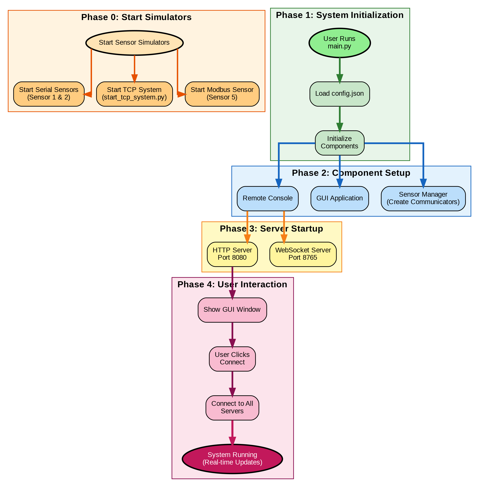

# Real-Time Production Line Sensor Dashboard with Remote Access & Notifications  Project Documentation

## Table of Contents

1. [Project Overview](#project-overview)
2. [System Architecture](#system-architecture)
3. [Installation & Setup](#installation--setup)
4. [Project Structure](#project-structure)
5. [Core Components](#core-components)
6. [Configuration](#configuration)
7. [Sensor Communication](#sensor-communication)
8. [GUI Application](#gui-application)
9. [Remote Console](#remote-console)
10. [Alarm System](#alarm-system)
11. [Sensor Simulators](#sensor-simulators)
12. [Testing](#testing)
13. [Usage Guide](#usage-guide)
14. [API Reference](#api-reference)
15. [Troubleshooting](#troubleshooting)

---

## Project Overview

The **Production Line Remote Maintenance Console** is a comprehensive real-time monitoring and maintenance solution for industrial production lines. It monitors multiple sensors across different communication protocols, provides real-time visualization, intelligent alarm management, and secure remote access capabilities.

### Key Features

- **Multi-Protocol Support**: Serial (PTY), TCP/IP, and Modbus/TCP
- **Real-Time Monitoring**: Live sensor data updates with 2+ Hz refresh rate
- **Real-Time Rolling Plots**: Per-sensor plots with 15-second rolling window and fixed y-axis
- **Intelligent Alarm Management**: Configurable high/low limits with automatic alarm detection
- **State Transition Notifications**: Notifications sent only on state changes (prevents spam)
- **Alarm Log with Limits**: Complete alarm history including low/high limits at time of alarm
- **Desktop GUI**: Modern PyQt5 interface with light theme, color-coded status, and resizable window
- **Maintenance Console**: Password-protected tab with alarm log, system tools, and live log viewer
- **Remote Console**: Web-based remote access via WebSocket with authentication
- **Global System Health**: Overall system health indicator (Normal/Warning/Critical)
- **Color-Coded Status**: Visual status indicators (Green: OK, Yellow: Alarm, Red: Faulty)
- **Notification System**: Webhook (non-blocking, async) and Desktop notifications (Windows/Linux)
- **Thread-Safe Architecture**: Worker threads for non-blocking I/O
- **Cross-Platform Support**: Full Windows and Linux compatibility with platform-specific optimizations
- **Headless Startup**: Automated system startup scripts for both platforms
- **Modular Design**: Clean separation of concerns
- **Application Icon**: Custom icon and favicon for professional branding (taskbar, window, notifications, web)

### Supported Protocols

1. **Serial Communication**: Supports multiple sensors using pseudo-terminals (Linux) or COM ports (Windows)

   - **Linux**: Uses PTY (pseudo-terminals) - `/dev/pts/X` devices
   - **Windows**: Uses COM ports - real or virtual COM port pairs (e.g., COM20-COM21)
   - Configurable baudrate (default: 115200)
   - 8N1 configuration (8 data bits, No parity, 1 stop bit)
   - JSON frame format
   - **Virtual COM Port Pairs (Windows)**: When using com0com, simulator uses one port (COM20) and application connects to paired port (COM21) - automatically handled by startup script
   - **Worker Thread Model**: One worker thread per unique serial port
     - Multiple sensors on the same port share one worker thread
     - Example: 3 sensors on 3 different ports = 3 worker threads
     - Example: 5 sensors on 2 ports (3 on port A, 2 on port B) = 2 worker threads

2. **TCP/IP Communication**: Supports multiple sensors using TCP sockets

   - JSON frame format
   - Configurable host and port
   - **Worker Thread Model**: One worker thread per unique TCP server (host:port)
     - Multiple sensors connecting to the same server share one worker thread
     - Example: 4 sensors on 2 different servers = 2 worker threads
     - Example: 6 sensors on 3 servers (2 per server) = 3 worker threads

3. **Modbus/TCP Communication**: Supports multiple sensors using Modbus protocol
   - Function Code 3 (Read Holding Registers)
   - 16-bit integer encoding (scaled by 10 for decimal precision)
   - Configurable unit ID and register address
   - **Worker Thread Model**: One worker thread per unique Modbus server (host:port)
     - Multiple sensors on the same server share one worker thread
     - Example: 2 sensors on 2 different servers = 2 worker threads

---

## System Architecture

### High-Level Architecture

The following diagrams provide visual representations of the system architecture:

#### System Architecture Diagram


_Complete system architecture showing all components organized into logical layers: Sensor Simulators, Communication Layer, Management Layer, GUI Application, Remote Console, and Notification System. Components are color-coded and grouped for clarity._

#### Data Flow Diagram


_Data flow sequence showing how sensor data moves through the system from simulators to GUI and remote console, with numbered processing steps (1-6)._

#### Startup Sequence Diagram



_System startup flowchart showing the phased initialization process from user launch through component setup, server startup, to system running state._

#### Webhook Background Thread Flowchart


_Webhook background thread implementation flowchart showing how webhooks are sent asynchronously in a separate thread to prevent GUI freezing. The diagram illustrates the separation between the main GUI thread and the background thread, thread-safe locking mechanism, and the non-blocking nature of webhook notifications. Key benefits: GUI never freezes, thread-safe implementation, works on both Windows and Linux._

### Text-Based Architecture Overview

```
┌─────────────────────────────────────────────────────────────┐
│                    Desktop GUI Application                  │
│                    (PyQt5 Main Window)                      │
└──────────────────────┬──────────────────────────────────────┘
                       │
                       │ Signals (Thread-Safe)
                       │
┌──────────────────────▼──────────────────────────────────────┐
│              Sensor Manager (Unified Manager)               │
│  ┌──────────────┐  ┌──────────────┐  ┌──────────────┐      │
│  │   Serial     │  │     TCP     │  │   Modbus     │      │
│  │ Communicator │  │ Communicator│  │ Communicator │      │
│  └──────┬───────┘  └──────┬───────┘  └──────┬───────┘      │
│         │                 │                  │              │
│         └─────────────────┼──────────────────┘              │
│                           │                                  │
│              Worker Threads (Non-Blocking)                 │
└───────────────────────────┼──────────────────────────────────┘
                            │
                            │ Physical/Simulated Connections
                            │
┌───────────────────────────▼──────────────────────────────────┐
│              Sensor Simulators / Hardware                    │
│  ┌──────┐  ┌──────┐  ┌──────┐  ┌──────┐  ┌──────┐          │
│  │Sensor│  │Sensor│  │Sensor│  │Sensor│  │Sensor│          │
│  │  1   │  │  2   │  │  3   │  │  4   │  │  5   │          │
│  │(PTY) │  │(PTY) │  │(TCP) │  │(TCP) │  │(Mod) │          │
│  └──────┘  └──────┘  └──────┘  └──────┘  └──────┘          │
└──────────────────────────────────────────────────────────────┘

┌─────────────────────────────────────────────────────────────┐
│              Remote Console Server (WebSocket)              │
│              HTTP Server (Web Interface)                    │
└─────────────────────────────────────────────────────────────┘

┌─────────────────────────────────────────────────────────────┐
│              Alarm Notification System                       │
│              (Webhook [Async], Desktop Notifications)        │
└─────────────────────────────────────────────────────────────┘
```

### Threading Model

The system uses a **thread-safe architecture** with the following principles:

1. **Worker Threads**: All sensor communication happens in separate worker threads
2. **Port-Based Worker Creation**: Worker threads are created per unique communication endpoint, not per sensor
   - **Serial**: One worker thread per unique serial port (multiple sensors can share a port)
   - **TCP**: One worker thread per unique TCP server (host:port combination)
   - **Modbus**: One worker thread per unique Modbus server (host:port combination)
3. **PyQt Signals**: Thread-safe communication from worker threads to GUI thread
4. **No Direct GUI Updates**: Worker threads never directly update GUI components
5. **Locking**: Thread locks protect shared data structures

**Thread Flow:**

```
Worker Thread → Reading Received → Signal Emitted → GUI Thread Receives → GUI Updated
```

**Example Worker Thread Scenarios:**

- **Scenario 1**: 5 serial sensors on 5 different ports
  - Result: 5 worker threads (one per port)
- **Scenario 2**: 5 serial sensors on 2 ports (3 on `/dev/pts/7`, 2 on `/dev/pts/9`)
  - Result: 2 worker threads (one per port, sensors share workers)
- **Scenario 3**: 4 TCP sensors on 2 servers (2 sensors on `localhost:5000`, 2 on `localhost:5001`)
  - Result: 2 worker threads (one per server)
- **Scenario 4**: Mixed setup with 3 serial (2 ports), 4 TCP (2 servers), 2 Modbus (1 server)
  - Result: 2 + 2 + 1 = 5 total worker threads

---

## Installation & Setup

### Prerequisites

- Python 3.8 or higher
- Linux (Ubuntu recommended) or Windows
- Internet connection (for installing packages)

### Step 1: Install Dependencies

```bash
cd /path/to/Si-ware
pip install -r requirements.txt
```

**Required Packages:**

- `PyQt5==5.15.10` - GUI framework
- `pyqtgraph==0.13.3` - Real-time plotting
- `numpy==1.24.3` - Numerical operations
- `pyserial==3.5` - Serial communication
- `pymodbus==3.5.4` - Modbus communication
- `websockets==12.0` - WebSocket server
- `aiohttp==3.9.1` - Async HTTP
- `requests==2.31.0` - HTTP requests
- `pytest==7.4.3` - Testing framework
- `pytest-qt==4.2.0` - PyQt testing

### Step 2: Verify Installation

```bash
python3 scripts/verify_project.py
```

This script checks:

- All required files exist
- Python imports work correctly
- Configuration is valid
- Dependencies are installed

### Step 3: Start Sensor Simulators

The system requires sensor simulators to be running. You have several options:

**Option 1: Headless System Startup (Recommended - Easiest)**

This automatically starts all simulators, updates config.json, and launches the main application:

**Linux:**
```bash
./scripts/start_system_linux.sh
```

**Windows:**
```cmd
scripts\start_system_windows.bat
```

**Option 2: Start All Sensors Manually**

```bash
./scripts/run_all_sensors.sh
```

**Option 3: Start Individual Sensors**

````bash
# Example: Starting multiple serial sensors
# Terminal 1 - Serial Sensor 1 (Temperature, Serial/PTY)
python3 simulators/sensor_1.py

# Terminal 2 - Serial Sensor 2 (Pressure, Serial/PTY)
python3 simulators/sensor_2.py

# Example: Starting TCP system (servers and clients)
# Terminal 3 - Start TCP servers and connect sensor clients
python3 simulators/start_tcp_system.py --server-ports 5000 5001 \
  --sensor flow:3:localhost:5000:10:100:L/min \
  --sensor vibration:4:localhost:5000:0:5:mm/s

# Example: Starting Modbus sensor
# Terminal 4 - Modbus Sensor (Voltage, Modbus/TCP)
python3 simulators/sensor_5.py

**Note**: The number of terminals/simulators depends on your configuration. You can run as many sensor simulators as needed, and the main application will automatically create worker threads based on unique communication endpoints.

**Multiple Serial Sensors:**
```bash
# Run multiple serial sensors in one command
python3 simulators/sensor_serial.py \
  --config "temperature:1:115200:8N1" \
  --config "pressure:2:115200:8N1" \
  --config "flow:3:115200:8N1"

# Or run in separate terminals
python3 simulators/sensor_serial.py --config "temperature:1:115200:8N1"
python3 simulators/sensor_serial.py --config "pressure:2:115200:8N1"
````

**Note:** For Serial sensors, note the PTY device path printed when they start (e.g., `/dev/pts/9`). Update `config/config.json` with the correct paths.

### Step 4: Start Main Application

```bash
python3 main.py
```

Or use the convenience script:

```bash
./scripts/run_app.sh
```

The GUI application will start and automatically:

- Start the Remote Console WebSocket server (port 8765)
- Start the HTTP server for web interface (port 8080)
- Load sensor configurations from `config/config.json`

### Step 5: Access Remote Console (Optional)

Once the main application is running, open your browser:

```
http://localhost:8080/remote_console_client.html
```

Default credentials:

- **Admin**: `admin` / `admin123` (full access)
- **Operator**: `operator` / `operator123` (read-only)
- **Viewer**: `viewer` / `viewer123` (read-only)

---

## Project Structure

```
RT-ProductionLine-Sensors-Dashboard/
├── main.py                              # Main entry point
├── requirements.txt                     # Python dependencies
├── fav.png                              # Application icon and favicon
├── README.md                            # Quick overview
├── Project_Documentation.pdf            # PDF version of documentation
└── SYSTEM_ARCHITECTURE.png              # System architecture diagram (root copy)
│
├── core/                                # Core data models
│   ├── __init__.py
│   └── sensor_data.py                   # SensorReading, SensorStatus, SensorConfig, AlarmEvent
│
├── sensors/                             # Sensor communication modules
│   ├── __init__.py
│   ├── sensor_manager.py               # Unified sensor manager
│   ├── sensor_serial_comm.py           # Serial/PTY communication
│   ├── sensor_tcp_comm.py              # TCP/IP communication
│   └── sensor_modbus_comm.py          # Modbus/TCP communication
│
├── gui/                                 # GUI components
│   ├── __init__.py
│   ├── main_gui.py                     # Main PyQt5 window
│   ├── components/                     # Reusable GUI components
│   │   ├── __init__.py
│   │   ├── splitter.py                # Non-resizable splitter
│   │   └── helpers.py                 # Helper classes
│   ├── stylesheet/                     # Styling
│   │   └── styles.qss                 # Light theme stylesheet
│   └── tabs/                          # Tab components (future modularization)
│       └── __init__.py
│
├── services/                            # Services
│   ├── __init__.py
│   ├── alarm_notifications.py          # Notification system
│   └── remote_console.py               # WebSocket remote console
│
├── simulators/                          # Sensor simulators
│   ├── README.md                        # Simulator documentation
│   ├── QUICK_START.md                   # Quick start guide
│   ├── sensor_serial.py                # Unified serial sensor simulator (PTY)
│   ├── start_tcp_system.py             # TCP sensor system launcher
│   ├── run_tcp_sensor_clients.py       # TCP sensor clients
│   ├── tcp_sensor_server.py            # TCP sensor server
│   └── sensor_modbus.py                # Unified Modbus sensor simulator
│
├── config/                              # Configuration
│   └── config.json                     # Main configuration file
│
├── web/                                 # Web interface
│   └── remote_console_client.html      # Remote console web client
│
├── scripts/                             # Utility scripts
│   ├── verify_project.py               # Project verification
│   ├── test_desktop_notifications.py   # Test desktop notifications
│   ├── test_modbus.py                  # Test Modbus communication
│   ├── test_websocket.py               # Test WebSocket connection
│   ├── test_webhook.py                 # Test webhook functionality
│   ├── test_webhook_server.py          # Test webhook server
│   ├── read_sensor_serial.py           # Read serial sensor data
│   ├── read_modbus_frame.py            # Read Modbus frames
│   ├── check_modbus_server.py          # Check Modbus server
│   ├── check_tcp_servers.py            # Check TCP servers
│   ├── start_system.py                 # Cross-platform system startup script
│   ├── start_system_linux.sh           # Linux system startup script
│   ├── start_system_windows.bat        # Windows system startup script
│   └── generate_flowchart.py           # Generate system flowchart
│
├── tests/                               # Unit tests
│   ├── __init__.py
│   ├── README.md                       # Test documentation
│   ├── test_sensor_data.py             # Sensor data tests (32 tests)
│   └── test_results.png                # Test execution screenshot
│
├── docs/                                # Documentation
│   ├── Project_Documentation.md         # Complete system documentation (this file)
│   ├── SYSTEM_FLOWCHART.md              # System flowchart documentation
│   ├── WINDOWS_COMPATIBILITY.md        # Windows compatibility guide
│   ├── SYSTEM_ARCHITECTURE.png         # System architecture diagram
│   ├── DATA_FLOW.png                    # Data flow diagram
│   ├── STARTUP_SEQUENCE.png             # Startup sequence diagram
│   ├── WEBHOOK_BACKGROUND_THREAD.png   # Webhook thread flowchart
│   └── Si-Ware_System_-_PE_Assesment_v3.pdf # Assessment document
│
└── com0com/                             # Windows COM port virtualization
    ├── com0com-3.0.0.0-i386-and-x64-signed.zip # com0com installer
    ├── install_com0com_simple.bat       # Simple installation script
    └── install_com0com.ps1              # PowerShell installation script
```

---

## Core Components

### 1. Core Data Models (`core/sensor_data.py`)

#### SensorStatus (Enum)

Represents the status of a sensor reading:

- `OK` - Value within normal limits
- `LOW_ALARM` - Value below low limit
- `HIGH_ALARM` - Value above high limit
- `FAULTY` - Sensor is faulty (value = -999.0)

#### SensorReading (Dataclass)

Represents a single sensor reading:

```python
@dataclass
class SensorReading:
    sensor_id: int
    sensor_name: str
    value: float
    timestamp: datetime
    status: SensorStatus
    unit: str = ""
```

#### AlarmEvent (Dataclass)

Represents an alarm event:

```python
@dataclass
class AlarmEvent:
    timestamp: datetime
    sensor_name: str
    sensor_id: int
    value: float
    alarm_type: str  # "LOW", "HIGH", or "FAULT"
    unit: str = ""
    low_limit: float = 0.0  # Low limit at time of alarm
    high_limit: float = 0.0  # High limit at time of alarm
```

#### SensorConfig (Class)

Configuration for a sensor with alarm limits:

```python
class SensorConfig:
    def __init__(self, name: str, sensor_id: int,
                 low_limit: float, high_limit: float, unit: str = ""):
        self.name = name
        self.sensor_id = sensor_id
        self.low_limit = low_limit
        self.high_limit = high_limit
        self.unit = unit

    def check_alarm(self, value: float) -> Optional[AlarmEvent]:
        """Check if value triggers an alarm"""
        if value < self.low_limit:
            return AlarmEvent(...)  # LOW alarm
        elif value > self.high_limit:
            return AlarmEvent(...)  # HIGH alarm
        return None

    def get_status(self, value: float, is_faulty: bool = False) -> SensorStatus:
        """Get sensor status based on value"""
        if is_faulty:
            return SensorStatus.FAULTY
        if value < self.low_limit:
            return SensorStatus.LOW_ALARM
        if value > self.high_limit:
            return SensorStatus.HIGH_ALARM
        return SensorStatus.OK
```

### 2. Sensor Manager (`sensors/sensor_manager.py`)

The **SensorManager** is the central component that manages all sensor communications. It provides a unified interface for multiple protocols.

**Key Features:**

- Manages Serial, TCP, and Modbus communicators
- Thread-safe sensor reading callbacks
- Automatic alarm detection
- Connection management

**Usage:**

```python
from sensors.sensor_manager import SensorManager
from core.sensor_data import SensorConfig

# Create manager
manager = SensorManager()

# Add a sensor
config = SensorConfig(
    name="Temperature Sensor 1",
    sensor_id=1,
    low_limit=20.0,
    high_limit=80.0,
    unit="°C"
)

manager.add_sensor(
    sensor_id=1,
    config=config,
    protocol="serial",
    protocol_config={
        "port": "/dev/pts/9",
        "baudrate": 115200
    }
)

# Connect to all sensors
results = manager.connect_all()

# Connect signals (PyQt)
manager.sensor_reading_received.connect(on_reading_received)
manager.alarm_triggered.connect(on_alarm_triggered)
```

**Methods:**

- `add_sensor()` - Add a sensor with protocol configuration
  - **Automatic Grouping**: Sensors with the same port/server are automatically grouped
  - **Shared Workers**: Multiple sensors on the same port share one worker thread
  - **Example**: Adding 3 serial sensors on `/dev/pts/7` creates 1 communicator with 1 worker thread
- `connect_all()` - Connect all communicators (one connection per unique port/server)
- `disconnect_all()` - Disconnect all communicators
- `get_connection_status()` - Get connection status for all communicators (not per sensor)

**Worker Thread Creation Logic:**

- Serial: Key = `f"serial_{port}"` → One communicator per unique port
- TCP: Key = `f"tcp_{host}_{port}"` → One communicator per unique server
- Modbus: Key = `f"modbus_{host}_{port}"` → One communicator per unique server

**Example:**

```python
# Adding 5 sensors:
# - 2 serial sensors on /dev/pts/7
# - 1 serial sensor on /dev/pts/9
# - 2 TCP sensors on localhost:5000

manager.add_sensor(1, config1, "serial", {"port": "/dev/pts/7", ...})  # Creates SerialCommunicator 1
manager.add_sensor(2, config2, "serial", {"port": "/dev/pts/7", ...})  # Reuses SerialCommunicator 1
manager.add_sensor(3, config3, "serial", {"port": "/dev/pts/9", ...})  # Creates SerialCommunicator 2
manager.add_sensor(4, config4, "tcp", {"host": "localhost", "port": 5000, ...})  # Creates TCPCommunicator 1
manager.add_sensor(5, config5, "tcp", {"host": "localhost", "port": 5000, ...})  # Reuses TCPCommunicator 1

# Result: 3 communicators = 3 worker threads (not 5)
```

**Signals:**

- `sensor_reading_received` - Emitted when a reading is received
- `alarm_triggered` - Emitted when an alarm is detected

### 3. Sensor Communicators

#### SerialSensorCommunicator (`sensors/sensor_serial_comm.py`)

Handles Serial/PTY communication:

- Connects to PTY devices (pseudo-terminals)
- Reads JSON frames terminated by newline
- Runs in worker thread
- Thread-safe callback mechanism

**Frame Format (JSON):**

```json
{
  "sensor_id": 1,
  "sensor_name": "Temperature Sensor 1",
  "value": 45.5,
  "timestamp": "2025-12-28T12:00:00",
  "status": "OK",
  "unit": "°C"
}
```

#### TCPSensorCommunicator (`sensors/sensor_tcp_comm.py`)

Handles TCP/IP communication:

- Connects to TCP servers
- Reads JSON frames terminated by newline
- Runs in worker thread
- Automatic reconnection on failure

**Frame Format:** Same as Serial (JSON)

#### ModbusSensorCommunicator (`sensors/sensor_modbus_comm.py`)

Handles Modbus/TCP communication:

- Connects to Modbus/TCP servers
- Uses Function Code 3 (Read Holding Registers)
- Reads 16-bit integer values (scaled by 10)
- Converts to float by dividing by 10

**Frame Format (Modbus/TCP):**

- **Request**: MBAP Header (7 bytes) + PDU (Function Code 3 + Register Address + Count)
- **Response**: MBAP Header (7 bytes) + PDU (Function Code 3 + Byte Count + Register Values)
- **Value Encoding**: 16-bit integer (scaled by 10), e.g., 455 = 45.5

---

## Configuration

### Configuration File (`config/config.json`)

The configuration file contains all system settings:

```json
{
  "sensors": [
    {
      "name": "Temperature Sensor 1",
      "id": 1,
      "low_limit": 20.0,
      "high_limit": 80.0,
      "unit": "°C",
      "protocol": "serial",
      "protocol_config": {
        "port": "/dev/pts/9",
        "baudrate": 115200,
        "bytesize": 8,
        "parity": "N",
        "stopbits": 1
      },
      "simulator_config": {
        "baudrate": 115200,
        "bytesize": 8,
        "parity": "N",
        "stopbits": 1
      }
    }
  ],
  "update_rate": 0.5,
  "alarm_settings": {
    "enable_notifications": true,
    "enable_desktop_notifications": true,
    "webhook_url": "http://localhost:3000/webhook"
  },
  "remote_console": {
    "enabled": true,
    "host": "localhost",
    "port": 8765,
    "http_port": 8080,
    "users": {
      "admin": {
        "password": "admin123",
        "permissions": ["read", "write", "commands"]
      }
    }
  }
}
```

### Configuration Sections

#### Sensors Array

Each sensor entry contains:

- `name`: Human-readable sensor name
- `id`: Unique sensor ID (1-5)
- `low_limit`: Lower alarm threshold
- `high_limit`: Upper alarm threshold
- `unit`: Unit of measurement (e.g., "°C", "PSI")
- `protocol`: Communication protocol ("serial", "tcp", "modbus")
- `protocol_config`: Protocol-specific settings
- `simulator_config`: Simulator-specific settings

#### Alarm Settings

- `enable_notifications`: Enable/disable all notifications
- `enable_desktop_notifications`: Enable desktop notifications
- `webhook_url`: URL for webhook POST requests

#### Remote Console

- `enabled`: Enable/disable remote console
- `host`: WebSocket server host
- `port`: WebSocket server port (default: 8765)
- `http_port`: HTTP server port (default: 8080)
- `users`: User authentication credentials and permissions

### Updating PTY Paths

For Serial sensors (1 & 2), the PTY path is dynamic. After starting the simulator:

1. Note the PTY path printed (e.g., `PTY device: /dev/pts/9`)
2. Update `config/config.json` with the correct path
3. Restart the main application

---

## Sensor Communication

### Serial Communication (PTY)

**Protocol:** Serial over Pseudo-Terminal (PTY)

**Configuration:**

- Baudrate: 115200 (configurable)
- Data bits: 8
- Parity: None (N)
- Stop bits: 1
- Frame format: JSON terminated by newline

**How It Works:**

1. Simulator creates a PTY pair (master/slave)
2. Simulator writes to master file descriptor
3. Application connects to slave device (e.g., `/dev/pts/9`)
4. Application reads JSON frames from serial port
5. Frames are parsed and converted to `SensorReading` objects

**Example Frame:**

```json
{
  "sensor_id": 1,
  "sensor_name": "Temperature Sensor 1",
  "value": 45.5,
  "timestamp": "2025-12-28T12:00:00",
  "status": "OK",
  "unit": "°C"
}
```

### TCP Communication

**Protocol:** TCP/IP Socket

**Configuration:**

- Host: localhost (configurable)
- Port: 5000, 5001 (configurable)
- Frame format: JSON terminated by newline

**How It Works:**

1. Simulator creates TCP server on specified port
2. Application connects as TCP client
3. Simulator sends JSON frames continuously
4. Application reads frames and parses them

**Example Frame:** Same as Serial (JSON)

### Modbus/TCP Communication

**Protocol:** Modbus/TCP (Function Code 3)

**Configuration:**

- Host: localhost
- Port: 1502 (default Modbus port)
- Unit ID: 1
- Register: 0

**How It Works:**

1. Simulator creates Modbus/TCP server
2. Application connects as Modbus client
3. Application sends Function Code 3 requests
4. Simulator responds with register values
5. Values are 16-bit integers scaled by 10 (e.g., 455 = 45.5)

**Frame Structure:**

- **MBAP Header (7 bytes):**

  - Transaction ID (2 bytes)
  - Protocol ID (2 bytes) = 0
  - Length (2 bytes)
  - Unit ID (1 byte)

- **PDU (Protocol Data Unit):**
  - Function Code (1 byte) = 3
  - Starting Address (2 bytes)
  - Quantity (2 bytes)
  - Response: Byte Count + Register Values

**Value Encoding:**

- Values stored as 16-bit integers (0-65535)
- Scaled by 10 for decimal precision (e.g., 455 = 45.5)
- Negative values use two's complement (e.g., 65536 - 9990 = 55546 for -999.0)

---

## GUI Application

### Main Window (`gui/main_gui.py`)

The desktop application provides a modern PyQt5 interface with a light theme, resizable window, and comprehensive monitoring capabilities.

#### Dashboard Tab

The Dashboard tab is the main monitoring interface, featuring:

**Left Panel - Sensor Status Table:**

- **Real-Time Sensor Readings**: Live data from all configured sensors
- **Color-Coded Rows**: Visual status indication
  - 🟢 **Green**: Sensor OK (value within limits)
  - 🟡 **Yellow**: Low or High Alarm (value outside limits)
  - 🔴 **Red**: Faulty Sensor (value = -999 or connection lost)
- **Columns**:
  - **ID**: Sensor ID (numeric, no prefix)
  - **Sensor Name**: Human-readable sensor name
  - **Latest Value**: Most recent sensor reading
  - **Unit**: Unit of measurement (°C, PSI, L/min, etc.)
  - **Timestamp**: Time of last reading
  - **Status**: Current status (OK, LOW_ALARM, HIGH_ALARM, FAULTY)
- **Scrollable**: Supports variable number of sensors
- **Read-Only**: Table is read-only to prevent accidental modifications
- **Auto-Sizing Columns**: Columns automatically size to content

**Right Panel - Real-Time Plots:**

- **Individual Plots**: One plot per sensor
- **Rolling Window**: Shows last 15 seconds of data (configurable 10-20 seconds)
- **Fixed Y-Axis**: Y-axis range fixed based on sensor's low_limit and high_limit with padding
- **Time-Based X-Axis**: X-axis shows time in seconds (0-15s)
- **Professional Styling**:
  - Thin plot lines (2.5px width)
  - Antialiasing enabled
  - Subtle grid (20% opacity)
  - Clean axis labels
- **Scrollable**: Scrollable container for multiple sensors
- **Compact Height**: Optimized plot height for better visibility

**Global System Health Indicator:**

- **Location**: Beside Connect/Disconnect button in header
- **Status Levels**:
  - 🟢 **Normal / Healthy**: All sensors OK, no alarms
  - 🟡 **Warning / Degraded**: Some sensors in alarm state
  - 🔴 **Critical / Fault**: One or more sensors faulty
- **Compact Display**: Shows overall system health at a glance

**Dashboard Alarm Table:**

- **Quick View**: Last 10 alarms displayed directly on dashboard
- **Columns**: Time, Sensor Name, Value, Alarm Type, Low Limit, High Limit, Unit
- **Real-Time Updates**: Automatically updates when new alarms occur
- **Located**: Under sensor status table for quick reference

**Layout:**

- **Split Layout**: Sensor table on left, plots on right
- **Non-Resizable Splitter**: Fixed layout ratio (cannot be dragged)
- **Resizable Window**: Main window can be resized
- **Light Theme**: Modern, clean interface

#### Maintenance Console Tab

The Maintenance Console provides secure, password-protected access to advanced features:

**Authentication:**

- **Username/Password**: Credentials from `config.json` → `remote_console.users`
- **Secure Access**: Content hidden until authenticated
- **User Info Display**: Shows logged-in username
- **Logout**: Secure logout functionality
- **Web Server Link**: Direct link to web interface

**Sub-Tabs (Available After Authentication):**

1. **Alarm Log Tab:**

   - **Complete Alarm History**: All alarms with full details
   - **Columns**:
     - Time
     - Sensor Name
     - Value
     - Alarm Type (LOW, HIGH, FAULT)
     - **Low Limit** (at time of alarm)
     - **High Limit** (at time of alarm)
     - Unit
   - **Export to CSV**: Export alarm log to CSV file
   - **Clear Log**: Clear all alarms (with confirmation)
   - **Real-Time Updates**: Automatically updates when new alarms occur

2. **System Tools Tab:**

   - **Run Self-Test**: Comprehensive system diagnostics
     - Sensor connections
     - Communication status
     - System health checks
   - **Get Snapshot**: Detailed system state
     - Current sensor readings
     - Connection status
     - Recent alarms
     - System statistics
   - **Results Display**: Formatted text output of test/snapshot results

3. **Live Log Viewer Tab:**
   - **Real-Time System Logs**: Live log stream of system events
   - **Color-Coded Log Levels**:
     - **INFO** (Blue): Informational messages
     - **WARNING** (Orange): Warning messages
     - **ERROR** (Red): Error messages
     - **ALARM** (Yellow): Alarm events
     - **FAULT** (Red): Faulty sensor events
   - **Logged Events**:
     - User login/logout events
     - Alarm clearing events (from desktop and web)
     - Sensor connection attempts (success/failure)
     - System diagnostics (self-test, snapshot)
     - Alarm triggers
     - Sensor recovery events
   - **Manual Scroll Control**: No forced auto-scrolling (user controls scrolling)
   - **Chronological Order**: Newest entries at top (inserted at top)
   - **Entry Limit**: Keeps last 100 entries for performance

### Features

1. **Real-Time Updates**: Sensor data updates at 2+ Hz
2. **Thread-Safe**: All updates happen in GUI thread via signals
3. **Auto-Connect**: Connects to sensors on startup (if configured)
4. **Remote Console Integration**: Starts WebSocket and HTTP servers automatically
5. **State Transition Notifications**: Notifications sent only on state transitions (prevents spam)
6. **Color-Coded Status**: Visual feedback for sensor and system health
7. **Rolling Plots**: Real-time plots with configurable time window
8. **Application Icon**: Custom icon for desktop application
9. **Light Theme**: Modern, professional appearance

### Usage

1. **Start Application**: `python3 main.py`
2. **Connect to Sensors**: Click "Connect" button
3. **View Dashboard**: Monitor real-time sensor data, plots, and alarms
4. **Check System Health**: View global health indicator
5. **Access Maintenance Console**:
   - Click "Maintenance Console" tab
   - Enter username and password
   - Access alarm log, system tools, and live logs
6. **Remote Access**: Open web interface at `http://localhost:8080/remote_console_client.html`

---

## Remote Console

### Overview

The Remote Console provides web-based remote access to the monitoring system via WebSocket.

### Features

- **Real-Time Data**: Live sensor readings and alarms
- **Authentication**: User-based access control
- **Commands**: System control commands
- **Web Interface**: Modern HTML/JavaScript client

### WebSocket Server

**Port:** 8765 (configurable)

**Protocol:** WebSocket (JSON messages)

**Authentication:**

1. Client connects to WebSocket
2. Client sends authentication message:
   ```json
   {
     "type": "auth",
     "username": "admin",
     "password": "admin123"
   }
   ```
3. Server responds with success/failure
4. Authenticated clients can send commands

### HTTP Server

**Port:** 8080 (configurable)

**Purpose:** Serves the web interface

**URL:** `http://localhost:8080/remote_console_client.html`

**Dynamic Configuration:** The server automatically injects the WebSocket URL from `config.json` into the HTML.

### Available Commands

#### 1. Get Status

```json
{
  "type": "command",
  "command": "get_status"
}
```

**Response:**

```json
{
  "type": "status",
  "sensor_count": 5,
  "alarm_count": 2,
  "timestamp": "2025-12-28T12:00:00"
}
```

#### 2. Get Sensors

```json
{
  "type": "command",
  "command": "get_sensors"
}
```

**Response:**

```json
{
  "type": "sensors",
  "sensors": [
    {
      "id": 1,
      "name": "Temperature Sensor 1",
      "value": 45.5,
      "status": "OK",
      "timestamp": "2025-12-28T12:00:00",
      "unit": "°C"
    }
  ]
}
```

#### 3. Get Alarms

```json
{
  "type": "command",
  "command": "get_alarms",
  "limit": 100
}
```

**Response:**

```json
{
  "type": "alarms",
  "alarms": [...],
  "count": 10
}
```

#### 4. Clear Alarms

```json
{
  "type": "command",
  "command": "clear_alarms"
}
```

**Requires:** `write` permission

#### 5. Run Self-Test

```json
{
  "type": "command",
  "command": "run_self_test"
}
```

**Requires:** `commands` permission

**Response:**

```json
{
  "type": "self_test",
  "results": {
    "overall_status": "PASS",
    "total_tests": 8,
    "passed": 7,
    "failed": 0,
    "warnings": 1,
    "tests": [...]
  }
}
```

#### 6. Get Snapshot

```json
{
  "type": "command",
  "command": "get_snapshot"
}
```

**Response:**

```json
{
  "type": "snapshot",
  "snapshot": {
    "timestamp": "2025-12-28T12:00:00",
    "system_status": {...},
    "sensors": [...],
    "recent_alarms": [...],
    "health_summary": {...}
  }
}
```

### Permissions

- **read**: View sensor data and alarms
- **write**: Clear alarms, modify settings
- **commands**: Execute system commands (self-test, snapshot)

### Web Interface

The web interface (`web/remote_console_client.html`) provides:

- **Title**: "Production line Remote Maintenance Console"
- **Favicon**: Custom favicon (`fav.png`)
- **Login Screen**: Authentication with username/password
- **System Status**: Real-time status display
- **Sensor Table**: Live sensor readings
- **Alarm Log Section**:
  - Complete alarm history
  - Columns: Time, Sensor, Value, Type, **Low Limit**, **High Limit**
  - Real-time updates
- **Live Log Viewer Section**:
  - Side-by-side with alarm log (on larger screens)
  - Real-time system logs
  - Color-coded log levels
  - Manual scroll control (no forced auto-scroll)
  - Shows: login/logout, alarm clearing, sensor connections, diagnostics
- **Commands**: Button interface for commands
- **Responsive Layout**: Alarm log and log viewer side-by-side on desktop, stacked on mobile

---

## Alarm System

### Alarm Detection

Alarms are automatically detected when:

1. Sensor value < `low_limit` → **LOW Alarm**
2. Sensor value > `high_limit` → **HIGH Alarm**
3. Sensor value = -999.0 → **Faulty Sensor**

### Alarm Processing

1. **Detection**: `SensorConfig.check_alarm()` checks value against limits
2. **Event Creation**: `AlarmEvent` object is created with:
   - Timestamp
   - Sensor information
   - Value
   - Alarm type (LOW, HIGH, FAULT)
   - **Low limit** (at time of alarm)
   - **High limit** (at time of alarm)
   - Unit
3. **Signal Emission**: `SensorManager` emits `alarm_triggered` PyQt signal (thread-safe)
4. **GUI Handler**: `MainWindow.on_alarm_triggered()` receives signal in GUI thread
5. **Notification**: `NotificationManager` sends notifications for all alarms (no limits or filtering)
   - **Webhook**: Sent asynchronously in background thread (non-blocking)
   - **Desktop**: Sent via platform-specific notification system
6. **Logging**: Alarm is added to alarm log (GUI and Remote Console)

### Notification Behavior

The system sends notifications for all alarms without any filtering or limits:

**Notification Rules:**

- **All Alarms**: Every alarm triggers both webhook and desktop notifications immediately
- **No State Transition Checks**: Notifications are sent regardless of previous sensor status
- **No Filtering**: All alarm types (LOW, HIGH, FAULT) trigger notifications
- **Complete Coverage**: Ensures no alarms are missed or filtered out

**Benefits:**

- Complete alarm visibility - every alarm is notified
- No missed notifications due to filtering
- Real-time alerting for all alarm conditions
- Immediate notification for every alarm occurrence

### Notification Methods

#### Desktop Notifications

- **Platform**: Linux (via `notify-send`) and Windows (via `win10toast`)
- **Automatic**: Enabled by default if system supports it
- **No Configuration**: Works out of the box
- **Unlimited**: All alarms trigger desktop notifications immediately

#### Webhook Notifications

- **Method**: HTTP POST request (non-blocking, runs in background thread)
- **Format**: JSON payload
- **URL**: Configurable in `config.json`
- **Unlimited**: All alarms trigger webhook notifications immediately - no filtering
- **Thread-Safe**: Webhooks are sent asynchronously to prevent GUI freezing (especially on Windows)
- **Platform Support**: Works on both Linux and Windows without blocking the main thread
- **Payload:**
  ```json
  {
    "event_type": "alarm",
    "sensor_id": 1,
    "sensor_name": "Temperature Sensor 1",
    "alarm_type": "HIGH",
    "value": 95.5,
    "unit": "°C",
    "timestamp": "2025-12-28T12:00:00",
    "low_limit": 20.0,
    "high_limit": 80.0
  }
  ```

#### Webhook Integration with GUI (Non-Blocking Architecture)

The webhook notification system is designed to work seamlessly with the PyQt5 GUI without causing any freezing or blocking. Here's how it works:

**Flow Overview:**

1. **Alarm Detection** → Sensor Manager detects an alarm condition
2. **Signal Emission** → Sensor Manager emits `alarm_triggered` PyQt signal
3. **GUI Handler** → `MainWindow.on_alarm_triggered()` receives the signal in the GUI thread
4. **Async Webhook Call** → GUI calls `notification_manager.send_webhook_async(alarm)`
5. **Background Thread** → Webhook HTTP request runs in a separate daemon thread
6. **GUI Continues** → GUI thread immediately continues without waiting

**Detailed Implementation:**

**Step 1: Alarm Triggered in GUI Thread**

When an alarm is detected, the `SensorManager` emits a PyQt signal:

```python
# In SensorManager (worker thread)
self.alarm_triggered.emit(alarm_event)  # Thread-safe signal emission
```

**Step 2: GUI Receives Signal**

The `MainWindow.on_alarm_triggered()` method is called in the GUI thread:

```python
def on_alarm_triggered(self, alarm: AlarmEvent):
    """Handle alarm event - send webhook and desktop notifications"""
    # This runs in the GUI thread (main thread)
    
    # Send webhook for ALL alarms - non-blocking
    if self.notification_manager.webhook_url:
        self.notification_manager.send_webhook_async(alarm)  # Non-blocking call
    
    # Send desktop notification (also non-blocking via QTimer)
    message = self.notification_manager._format_alarm_message(alarm)
    self.notification_manager.send_desktop_notification(alarm, message)
```

**Step 3: Background Thread Creation**

The `send_webhook_async()` method creates a background daemon thread:

```python
def send_webhook_async(self, alarm: AlarmEvent):
    """Send webhook POST notification in a background thread (non-blocking)
    
    This method prevents GUI freezing by running the network request
    in a separate daemon thread. Use this instead of send_webhook()
    when called from the GUI thread.
    """
    if not self.webhook_url:
        return
    
    def _send_in_thread():
        """Internal function to send webhook in background thread"""
        try:
            with self._webhook_lock:  # Thread-safe lock
                success = self.send_webhook(alarm)  # Blocking HTTP POST
                if success:
                    print(f"Webhook sent successfully for alarm: {alarm.sensor_name}")
                else:
                    print(f"Webhook failed for alarm: {alarm.sensor_name}")
        except Exception as e:
            print(f"Error in webhook thread: {e}")
    
    # Start webhook in background thread (daemon thread won't block app shutdown)
    thread = threading.Thread(target=_send_in_thread, daemon=True)
    thread.start()  # Returns immediately, GUI continues
```

**Key Features:**

1. **Non-Blocking**: The GUI thread never waits for the HTTP request to complete
2. **Thread-Safe**: Uses `threading.Lock` (`_webhook_lock`) to prevent race conditions
3. **Daemon Thread**: Background thread is marked as daemon, so it won't prevent application shutdown
4. **Error Handling**: Exceptions in the background thread are caught and logged
5. **Immediate Return**: `thread.start()` returns immediately, allowing GUI to continue

**Thread Safety:**

- **Lock Mechanism**: The `_webhook_lock` ensures only one webhook request executes at a time
- **No Shared State**: Each webhook request is independent, no shared mutable state
- **Exception Isolation**: Errors in background thread don't affect GUI thread

**Benefits:**

- **GUI Never Freezes**: Main thread is never blocked by network I/O
- **Responsive UI**: User can interact with GUI while webhooks are being sent
- **Cross-Platform**: Works identically on Windows and Linux
- **Scalable**: Multiple alarms can trigger webhooks without queuing delays
- **Reliable**: Thread-safe implementation prevents race conditions

**Visual Flow:**

See the [Webhook Background Thread Flowchart](WEBHOOK_BACKGROUND_THREAD.png) for a detailed visual representation of this architecture.

**Comparison: Blocking vs Non-Blocking**

**Blocking Approach (Old - Causes GUI Freeze):**
```python
# BAD: Blocks GUI thread
def on_alarm_triggered(self, alarm):
    response = requests.post(webhook_url, json=payload)  # GUI freezes here!
    # GUI is frozen until HTTP request completes (could be seconds)
```

**Non-Blocking Approach (Current - No GUI Freeze):**
```python
# GOOD: Returns immediately, runs in background
def on_alarm_triggered(self, alarm):
    self.notification_manager.send_webhook_async(alarm)  # Returns immediately
    # GUI continues immediately, HTTP request happens in background
```

### Testing Webhooks

A local test server is provided:

```bash
python3 scripts/test_webhook_server.py
```

This starts a server on `http://localhost:3000` that:

- Receives webhook POST requests
- Displays them on a web page
- Auto-refreshes every 5 seconds

Update `config.json`:

```json
"webhook_url": "http://localhost:3000/webhook"
```

---

## Sensor Simulators

### Overview

The system includes modular sensor simulators that can be configured for any number of sensors. Each simulator type supports multiple instances:

**Available Simulator Types:**

1. **Serial/PTY Simulators** (`simulators/sensor_1.py`, `sensor_2.py`): For serial communication

   - Each simulator creates its own PTY device
   - Can run multiple instances for multiple sensors
   - Example: Run `sensor_1.py` for Temperature, `sensor_2.py` for Pressure

2. **TCP Client Simulators** (`simulators/sensor_3_client.py`, `sensor_4_client.py`): For TCP communication

   - Connect as clients to TCP sensor servers
   - Can run multiple instances connecting to the same or different servers
   - Example: Multiple flow rate sensors connecting to different TCP servers

3. **Modbus/TCP Simulator** (`simulators/sensor_5.py`): For Modbus communication
   - Creates a Modbus/TCP server
   - Can handle multiple sensors via different unit IDs or registers
   - Example: Multiple voltage sensors on the same Modbus server

**Note**: The number of sensors is configurable via `config.json`. You can add as many sensors as needed, and the system will automatically create the appropriate worker threads based on unique ports/servers.

### Serial Simulators

**Features:**

- Creates PTY (pseudo-terminal) pair
- Configurable baudrate and serial parameters
- Generates realistic sensor values
- Sends JSON frames over PTY
- **Multiple Instance Support**: Can run multiple simulators concurrently

**Usage:**

```bash
# Single sensor
python3 simulators/sensor_serial.py --config "temperature:1:115200:8N1"

# Multiple sensors (same command)
python3 simulators/sensor_serial.py \
  --config "temperature:1:115200:8N1" \
  --config "pressure:2:115200:8N1" \
  --config "flow:3:115200:8N1"

# Or run in separate terminals
python3 simulators/sensor_serial.py --config "temperature:1:115200:8N1"
python3 simulators/sensor_serial.py --config "pressure:2:115200:8N1"
```

**Configuration Format:**

```
--config "sensor_type:sensor_id:baudrate:config"
```

**Example:**

```
--config "temperature:1:115200:8N1"
--config "pressure:2:115200:8N1"
```

**Output:**

```
Starting Sensor Simulator...
Sensor ID: 1
Sensor Type: temperature
PTY device: /dev/pts/9
Baudrate: 115200, 8N1
Press Ctrl+C to stop
```

**Configuration:**

- Baudrate: 115200 (default, configurable)
- Bytesize: 8
- Parity: N (None)
- Stopbits: 1

### TCP Simulators

**Architecture:**

- **TCP Server** (`simulators/tcp_sensor_server.py`): Central server that accepts sensor client connections
- **TCP Clients** (`simulators/sensor_3_client.py`, `sensor_4_client.py`): Individual sensor simulators that connect to the server
- Multiple clients can connect to the same server
- Multiple servers can run on different ports

**Features:**

- Modular client-server architecture
- Server acts as relay between sensor clients and main application
- Supports multiple servers on different ports
- Generates realistic trend-based sensor values
- Sends JSON frames over TCP

**Usage - Starting TCP System:**

```bash
# Start multiple TCP servers and connect sensor clients
python3 simulators/start_tcp_system.py \
  --server-ports 5000 5001 \
  --sensor flow:3:localhost:5000:10:100:L/min \
  --sensor vibration:4:localhost:5000:0:5:mm/s \
  --sensor flow:6:localhost:5001:10:100:L/min
```

**Configuration:**

- Host: Configurable (default: localhost)
- Port: Configurable per server (e.g., 5000, 5001, 5002, etc.)
- Multiple sensors can connect to the same server port

### Modbus Simulator (5)

**Features:**

- Creates Modbus/TCP server
- Updates holding registers with sensor values
- Responds to Function Code 3 requests
- Encodes values as 16-bit integers (scaled by 10)

**Usage:**

```bash
python3 simulators/sensor_5.py
```

**Configuration:**

- Host: localhost
- Port: 1502
- Unit ID: 1
- Register: 0

### Starting All Simulators

Use the convenience script:

```bash
./scripts/run_all_sensors.sh
```

This starts all configured simulators in separate terminal windows. The script reads the sensor configuration from `config.json` and starts the appropriate simulators for each sensor type.

**Example**: If your `config.json` defines:

- 3 serial sensors → Starts 3 serial simulator instances
- 4 TCP sensors → Starts TCP servers and connects 4 client instances
- 2 Modbus sensors → Starts 1 Modbus server (handles both sensors)

The system automatically manages worker threads based on unique ports/servers, not the total number of sensors.

---

## Testing

### Unit Tests

Run unit tests with pytest:

```bash
python3 -m pytest tests/test_sensor_data.py -v
```

**Test Coverage:**

- SensorConfig creation and validation
- Alarm detection (LOW, HIGH, None)
- Status determination (OK, LOW_ALARM, HIGH_ALARM, FAULTY)
- SensorReading creation
- AlarmEvent creation

### Test Scripts

#### Verify Project

```bash
python3 scripts/verify_project.py
```

Checks:

- All required files exist
- Python imports work
- Configuration is valid
- Dependencies are installed

#### Test WebSocket Connection

```bash
python3 scripts/test_websocket.py
```

#### Test Modbus Connection

```bash
python3 scripts/test_modbus.py
```

#### Test Webhook

```bash
# Start test server
python3 scripts/test_webhook_server.py

# In another terminal, send test webhook
python3 scripts/test_webhook.py
```

#### Read Sensor Data

```bash
# Read Serial sensor data (example: sensor on /dev/pts/7)
python3 scripts/read_sensor_serial.py

# Read Modbus frames
python3 scripts/read_modbus_frame.py
```

**Note**: The `read_sensor_serial.py` script is an example for reading serial sensor data. You can modify it to read from any serial port by updating the PTY path in the script or passing it as an argument.

---

## Usage Guide

### Quick Start

1. **Install Dependencies**

   ```bash
   pip install -r requirements.txt
   ```

2. **Start System (Headless - Recommended)**

   This automatically starts all simulators, updates config.json, and launches the application:

   **Linux:**
   ```bash
   ./scripts/start_system_linux.sh
   ```

   **Windows:**
   ```cmd
   scripts\start_system_windows.bat
   ```

   **What it does:**
   - Starts all sensor simulators (Serial, TCP, Modbus)
   - Automatically updates `config.json` with detected ports
   - On Windows: Handles COM port pairs (simulator COM20 → config COM21)
   - Starts webhook server (optional)
   - Launches main GUI application

3. **Manual Start (Alternative)**

   If you prefer to start components manually:

   **Start Simulators:**
   ```bash
   ./scripts/run_all_sensors.sh
   ```

   **Update Ports** (for Serial sensors):
   - **Linux**: Note PTY paths from simulator output (e.g., `/dev/pts/7`, `/dev/pts/9`)
   - **Windows**: Note COM ports. If using virtual COM port pairs, simulator uses COM20, application needs COM21
   - Update `config/config.json` with the actual ports

   **Start Application:**
   ```bash
   python3 main.py
   ```

4. **Access Remote Console** (optional)
   - Open: `http://localhost:8080/remote_console_client.html`
   - Login with: `admin` / `admin123`

### Daily Operations

#### Monitoring Sensors

1. Open the desktop application
2. Click "Connect" to connect to sensors
3. View Dashboard tab for real-time data
4. Check Alarm Log tab for alarms

#### Responding to Alarms

1. View alarm details in Alarm Log tab
2. Check sensor status in Dashboard
3. Take corrective action if needed
4. Clear alarms when resolved

#### Remote Monitoring

1. Open web interface: `http://localhost:8080/remote_console_client.html`
2. Login with appropriate credentials
3. View real-time sensor data
4. Run self-test or get snapshot as needed

### System Maintenance

#### Run Self-Test

- **Desktop**: System Tools tab → Run Self-Test
- **Remote**: Web interface → Run Self-Test button

#### Get System Snapshot

- **Desktop**: System Tools tab → Get Snapshot
- **Remote**: Web interface → Get Snapshot button

#### Clear Alarms

- **Desktop**: Alarm Log tab → Clear Log button
- **Remote**: Web interface → Clear Alarms button

---

## API Reference

### API Documentation

The Si-Ware system provides comprehensive API documentation in the following sections:

1. **Remote Console WebSocket API** (see below)
   - Complete WebSocket API documentation
   - Authentication and command reference
   - Request/response examples

2. **SensorManager API** (see below)
   - Sensor management methods
   - Connection handling
   - Configuration examples

3. **SensorConfig API** (see below)
   - Alarm detection methods
   - Status determination
   - Configuration options

The complete API reference is documented in this file and in the README.md file.

### Remote Console WebSocket API

The Remote Console provides a WebSocket-based API for remote access to sensor data, alarms, and system control.

#### Authentication

All connections require authentication:

```json
{
  "type": "auth",
  "username": "admin",
  "password": "admin123"
}
```

#### Available Commands

1. **get_status** - Get system status summary
2. **get_sensors** - Get all sensor readings
3. **get_alarms** - Get alarm log entries
4. **clear_alarms** - Clear alarm log (requires `write` permission)
5. **get_logs** - Get system log entries
6. **run_self_test** - Run system diagnostics (requires `commands` permission)
7. **get_snapshot** - Get detailed system snapshot
8. **set_limit** - Set alarm limits for a sensor (requires `write` permission)

#### Example Request/Response

**Request:**

```json
{
  "type": "command",
  "command": "get_status"
}
```

**Response:**

```json
{
  "type": "status",
  "sensor_count": 5,
  "alarm_count": 2,
  "timestamp": "2025-12-28T12:00:00"
}
```

For complete API documentation, see:

- **Remote Console WebSocket API** section above in this document
- **SensorManager API** section below in this document
- **README.md** - API Documentation section for WebSocket API reference

### SensorManager API

#### `add_sensor(sensor_id, config, protocol, protocol_config)`

Add a sensor to the manager.

**Parameters:**

- `sensor_id` (int): Unique sensor ID
- `config` (SensorConfig): Sensor configuration
- `protocol` (str): "serial", "tcp", or "modbus"
- `protocol_config` (dict): Protocol-specific configuration

**Example:**

```python
manager.add_sensor(
    sensor_id=1,
    config=sensor_config,
    protocol="serial",
    protocol_config={"port": "/dev/pts/9", "baudrate": 115200}
)
```

#### `connect_all() -> Dict[str, bool]`

Connect to all sensors.

**Returns:** Dictionary mapping communicator keys to connection status

#### `disconnect_all()`

Disconnect from all sensors.

#### `get_connection_status() -> Dict[str, bool]`

Get connection status for all communicators.

**Returns:** Dictionary mapping communicator keys to connection status

### Remote Console API

#### WebSocket Messages

**Authentication:**

```json
{
  "type": "auth",
  "username": "admin",
  "password": "admin123"
}
```

**Command:**

```json
{
  "type": "command",
  "command": "get_status"
}
```

**Response:**

```json
{
  "type": "status",
  "sensor_count": 5,
  "alarm_count": 2,
  "timestamp": "2025-12-28T12:00:00"
}
```

### SensorConfig API

#### `check_alarm(value: float) -> Optional[AlarmEvent]`

Check if a value triggers an alarm.

**Returns:** `AlarmEvent` if alarm triggered, `None` otherwise

#### `get_status(value: float, is_faulty: bool = False) -> SensorStatus`

Get sensor status based on value.

**Returns:** `SensorStatus` enum value

---

## Troubleshooting

### Common Issues

#### 1. "ModuleNotFoundError: No module named 'core'"

**Solution:** Run from project root directory or set PYTHONPATH:

```bash
PYTHONPATH=. python3 main.py
```

#### 2. "Serial port not found" or "Connection refused"

**Solution:**

- Ensure simulators are running
- Check PTY paths in `config.json` match simulator output
- Verify TCP/Modbus ports are not in use

#### 3. "WebSocket connection failed"

**Solution:**

- Ensure main application is running
- Check firewall settings
- Verify port 8765 is not in use

#### 4. "No sensor data received"

**Solution:**

- Check sensor connections (click "Connect" button)
- Verify simulators are running
- Check connection status in System Tools → Get Snapshot

#### 5. "PTY device not found" (Linux) or "COM port not found" (Windows)

**Solution (Linux):**
- Restart the simulator
- Update `config.json` with the new PTY path
- Restart the main application

**Solution (Windows):**
- Ensure COM port is specified with `--com-port COM20` when running simulator
- For virtual COM ports: Install com0com and create port pairs
- If using virtual COM port pairs: Simulator uses COM20, application needs COM21 (automatically handled by `start_system_windows.bat`)
- Update `config.json` with the correct COM port
- Restart the main application

#### 6. Windows: GUI freezes or hangs at startup

**Solution:**
- This has been fixed with asyncio event loop policy and non-blocking webhooks
- Ensure you're using the latest version of the code
- Webhooks now run in background threads and won't block the GUI
- If issues persist, disable webhooks in `config.json` by setting `"webhook_url": ""`

#### 7. Windows: Icon not appearing in taskbar

**Solution:**
- Icon handling has been improved with multiple sizes and absolute paths
- Try restarting the application
- Clear Windows icon cache if needed
- Ensure `fav.png` exists in the project root directory

### Debug Mode

Enable debug logging by modifying the code to add print statements or use Python's logging module.

### Connection Status

Check connection status:

1. Desktop: System Tools tab → Get Snapshot
2. Remote: Web interface → Get Snapshot command

This shows which sensors are connected and their status.

### Testing Individual Components

#### Test Serial Communication

```bash
python3 scripts/read_sensor_serial.py
```

#### Test Modbus Communication

```bash
python3 scripts/read_modbus_frame.py
```

#### Test WebSocket

```bash
python3 scripts/test_websocket.py
```

#### Test Webhook

```bash
# Terminal 1
python3 scripts/test_webhook_server.py

# Terminal 2
python3 scripts/test_webhook.py
```

---

## Additional Resources

### Documentation Files

- `README.md` - Quick overview and quick start guide
- `Project_Documentation.md` - Complete system documentation (this file)
- `Project_Documentation.pdf` - PDF version
- `docs/SYSTEM_FLOWCHART.md` - System flowchart documentation
- `docs/WINDOWS_COMPATIBILITY.md` - Windows compatibility guide
- `tests/README.md` - Unit tests documentation
- `simulators/README.md` - Sensor simulators documentation

### Scripts

- `scripts/verify_project.py` - Project verification
- `scripts/test_*.py` - Various test scripts
- `scripts/read_*.py` - Sensor reading scripts

### Configuration

- `config/config.json` - Main configuration file

---

## Conclusion

This comprehensive documentation covers all aspects of the Si-Ware Production Line Monitoring System. All documentation is contained in this single file and its PDF version. For additional help, examine the source code comments.

**Key Points:**

- Multi-protocol sensor support (Serial, TCP, Modbus)
- Thread-safe architecture with worker threads
- Real-time GUI with PyQt5
- Web-based remote console
- Comprehensive alarm system
- Modular, extensible design
- **Cross-platform**: Full Windows and Linux support with platform-specific optimizations
- **Headless startup**: Automated scripts (`start_system_linux.sh` / `start_system_windows.bat`) for easy deployment
- **Non-blocking operations**: Webhooks and notifications run in background threads (prevents GUI freezing)
- **Professional icons**: Custom icons for taskbar, window, notifications, and web favicon
- **Windows optimizations**: Asyncio event loop policy, COM port pair handling, thread-safe notifications

**System Requirements:**

- Python 3.8+
- Linux (Ubuntu recommended) or Windows
- Required Python packages (see `requirements.txt`)

**Support:**

- Refer to this comprehensive documentation for all information
- Run `scripts/verify_project.py` to verify installation
- Use test scripts to verify individual components

---

_Last Updated: January 2025_

## Recent Updates

### Version Updates (January 2025)

- **Real-Time Rolling Plots**: Per-sensor plots with 15-second rolling window and fixed y-axis based on sensor limits
- **Global System Health Indicator**: Overall system health display (Normal/Warning/Critical) beside Connect button
- **Color-Coded Sensor Status**: Visual status indicators with row-level color coding (Green: OK, Yellow: Alarm, Red: Faulty)
- **Maintenance Console Tab**: Password-protected tab with authentication from `config.json`
- **Alarm Log with Limits**: Alarm log now includes low_limit and high_limit at time of alarm
- **Live Log Viewer**: Real-time system logs including login/logout, alarm clearing, sensor connections, and diagnostics
- **Unlimited Notifications**: All alarms trigger webhook and desktop notifications immediately - no filtering or limits
- **Dashboard Alarm Table**: Quick view of last 10 alarms directly on dashboard
- **Application Icon**: Custom icon (`fav.png`) for both desktop application and web interface
- **Light Theme**: Modern, clean light theme interface
- **Resizable Window**: Main window can be resized for different screen sizes
- **Scrollable Components**: Sensor table and plots section are scrollable for variable number of sensors
- **Multiple Sensor Simulator Support**: Can run multiple serial sensor simulators concurrently
- **Web Interface Updates**: Alarm log and live log viewer side-by-side, includes low/high limits
- **Enhanced Logging**: Comprehensive system logging with color-coded levels
