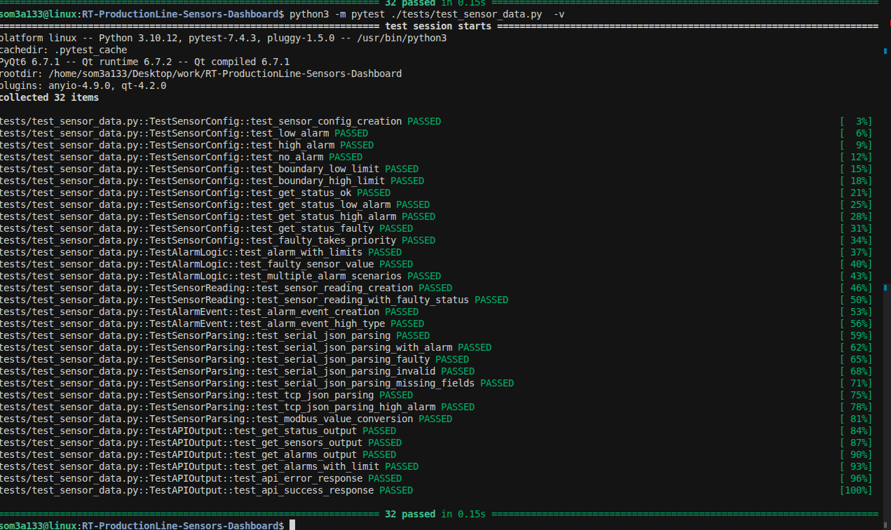

# Unit Tests

This directory contains unit tests for the Production Line Remote Maintenance Console system.

## Test File

- **`test_sensor_data.py`** - Comprehensive unit tests for sensor data models, alarm logic, sensor parsing, and API output

## Running Tests

### Run All Tests

```bash
# From project root
python3 -m pytest tests/ -v

# Or from tests directory
cd tests
python3 -m pytest -v
```

### Run Specific Test Class

```bash
# Test sensor configuration
python3 -m pytest tests/test_sensor_data.py::TestSensorConfig -v

# Test alarm logic
python3 -m pytest tests/test_sensor_data.py::TestAlarmLogic -v

# Test sensor parsing
python3 -m pytest tests/test_sensor_data.py::TestSensorParsing -v

# Test API output
python3 -m pytest tests/test_sensor_data.py::TestAPIOutput -v
```

### Run Specific Test

```bash
# Run a single test
python3 -m pytest tests/test_sensor_data.py::TestSensorConfig::test_low_alarm -v
```

### Run with Coverage

```bash
# Install coverage if needed: pip install pytest-cov
python3 -m pytest tests/ --cov=core --cov=sensors --cov=services --cov-report=html
```

## Test Structure

### 1. TestSensorConfig (11 tests)

Tests the `SensorConfig` class and alarm detection logic.

**Tests:**
- ✅ `test_sensor_config_creation` - Basic configuration creation
- ✅ `test_low_alarm` - Low alarm detection (value < low_limit)
- ✅ `test_high_alarm` - High alarm detection (value > high_limit)
- ✅ `test_no_alarm` - No alarm when value is within limits
- ✅ `test_boundary_low_limit` - Boundary condition at low limit
- ✅ `test_boundary_high_limit` - Boundary condition at high limit
- ✅ `test_get_status_ok` - Status OK for normal values
- ✅ `test_get_status_low_alarm` - Status LOW_ALARM
- ✅ `test_get_status_high_alarm` - Status HIGH_ALARM
- ✅ `test_get_status_faulty` - Status FAULTY
- ✅ `test_faulty_takes_priority` - FAULTY status overrides alarm status

**What it verifies:**
- Sensor configuration can be created with all required fields
- Alarm detection works correctly for LOW and HIGH conditions
- Boundary conditions are handled correctly (at exact limits)
- Status determination works for all states (OK, LOW_ALARM, HIGH_ALARM, FAULTY)
- FAULTY status takes priority over alarm status

---

### 2. TestAlarmLogic (3 tests)

Tests alarm logic with various scenarios.

**Tests:**
- ✅ `test_alarm_with_limits` - Alarm event creation with correct fields
- ✅ `test_faulty_sensor_value` - -999.0 is treated as faulty
- ✅ `test_multiple_alarm_scenarios` - Multiple alarm scenarios (normal, LOW, HIGH)

**What it verifies:**
- Alarm events are created with correct sensor information
- Faulty sensor value (-999.0) is properly detected
- Multiple alarm scenarios work correctly

---

### 3. TestSensorReading (2 tests)

Tests the `SensorReading` dataclass.

**Tests:**
- ✅ `test_sensor_reading_creation` - Basic SensorReading creation
- ✅ `test_sensor_reading_with_faulty_status` - SensorReading with FAULTY status

**What it verifies:**
- SensorReading can be created with all required fields
- Faulty sensor readings are handled correctly

---

### 4. TestAlarmEvent (2 tests)

Tests the `AlarmEvent` dataclass.

**Tests:**
- ✅ `test_alarm_event_creation` - LOW alarm event creation
- ✅ `test_alarm_event_high_type` - HIGH alarm event creation

**What it verifies:**
- AlarmEvent can be created with all required fields
- Both LOW and HIGH alarm types work correctly

---

### 5. TestSensorParsing (8 tests)

Tests sensor data parsing for different communication protocols.

#### Serial (PTY) JSON Parsing (5 tests)

**Tests:**
- ✅ `test_serial_json_parsing` - Valid JSON message parsing
- ✅ `test_serial_json_parsing_with_alarm` - Parsing with automatic alarm detection
- ✅ `test_serial_json_parsing_faulty` - Parsing -999.0 faulty value
- ✅ `test_serial_json_parsing_invalid` - Invalid JSON handling
- ✅ `test_serial_json_parsing_missing_fields` - Missing optional fields handling

**What it verifies:**
- JSON messages from serial sensors are parsed correctly
- Alarm status is automatically determined from sensor limits
- Faulty sensors (-999.0) are detected
- Invalid JSON is handled gracefully (returns None)
- Missing optional fields use default values

#### TCP JSON Parsing (2 tests)

**Tests:**
- ✅ `test_tcp_json_parsing` - Valid JSON dictionary parsing
- ✅ `test_tcp_json_parsing_high_alarm` - Parsing with high alarm detection

**What it verifies:**
- JSON dictionaries from TCP sensors are parsed correctly
- High alarm detection works for TCP sensors

#### Modbus Value Conversion (1 test)

**Tests:**
- ✅ `test_modbus_value_conversion` - 16-bit integer to float conversion

**What it verifies:**
- Modbus values (16-bit integers scaled by 10) are converted to floats correctly
  - Example: 455 → 45.5, 2205 → 220.5
- Negative values using two's complement are handled correctly
  - Example: 55546 → -999.0

---

### 6. TestAPIOutput (6 tests)

Tests WebSocket API response formats.

**Tests:**
- ✅ `test_get_status_output` - `get_status` API response format
- ✅ `test_get_sensors_output` - `get_sensors` API response format
- ✅ `test_get_alarms_output` - `get_alarms` API response format
- ✅ `test_get_alarms_with_limit` - `get_alarms` with limit parameter
- ✅ `test_api_error_response` - Error response format
- ✅ `test_api_success_response` - Success response format

**What it verifies:**
- All API responses have correct JSON structure
- Response types are correct (`status`, `sensors`, `alarms`, `error`, `success`)
- Required fields are present in all responses
- Limit parameter works correctly for alarm queries
- Error and success responses follow correct format

---

## Test Coverage Summary

| Category | Tests | Coverage |
|----------|-------|----------|
| **Sensor Configuration** | 11 | Alarm detection, status determination, boundary conditions |
| **Alarm Logic** | 3 | Multiple scenarios, faulty detection |
| **Data Models** | 4 | SensorReading, AlarmEvent creation |
| **Sensor Parsing** | 8 | Serial JSON, TCP JSON, Modbus conversion |
| **API Output** | 6 | All WebSocket API response formats |
| **Total** | **32** | **Comprehensive coverage** |

## What These Tests Verify

### ✅ Alarm Logic
- LOW alarm detection when value < low_limit
- HIGH alarm detection when value > high_limit
- No alarm when value is within limits
- Boundary conditions (at exact limits)
- FAULTY status detection (-999.0)
- FAULTY status priority over alarm status

### ✅ Sensor Parsing
- **Serial (PTY)**: JSON message parsing, alarm detection, faulty sensor handling
- **TCP**: JSON dictionary parsing, alarm detection
- **Modbus**: 16-bit integer to float conversion (scaled by 10)
- Error handling for invalid JSON
- Default values for missing fields

### ✅ API Output
- Correct JSON structure for all WebSocket API responses
- Required fields present in all responses
- Limit parameter functionality
- Error and success response formats

### ✅ Data Models
- SensorReading creation and validation
- AlarmEvent creation and validation
- SensorConfig creation and alarm detection

## Example Test Output

When you run the tests, you should see output similar to the following:



*Screenshot showing all 32 tests passing in 0.15 seconds - Test execution results from pytest*

The screenshot above shows:
- ✅ All 32 tests collected and executed
- ✅ All tests passing (100% success rate)
- ✅ Test execution time: 0.15 seconds
- ✅ Progress indicators showing test completion percentage
- ✅ Organized by test classes: TestSensorConfig, TestAlarmLogic, TestSensorReading, TestAlarmEvent, TestSensorParsing, TestAPIOutput

**Note:** To add your own screenshot, save it as `test_results.png` in the `tests/` directory.

### Text Output

```
============================= test session starts ==============================
platform linux -- Python 3.10.12, pytest-7.4.3
collected 32 items

tests/test_sensor_data.py::TestSensorConfig::test_sensor_config_creation PASSED [  3%]
tests/test_sensor_data.py::TestSensorConfig::test_low_alarm PASSED       [  6%]
tests/test_sensor_data.py::TestSensorConfig::test_high_alarm PASSED      [  9%]
tests/test_sensor_data.py::TestSensorConfig::test_no_alarm PASSED        [ 12%]
tests/test_sensor_data.py::TestSensorConfig::test_boundary_low_limit PASSED [ 15%]
tests/test_sensor_data.py::TestSensorConfig::test_boundary_high_limit PASSED [ 18%]
tests/test_sensor_data.py::TestSensorConfig::test_get_status_ok PASSED   [ 21%]
tests/test_sensor_data.py::TestSensorConfig::test_get_status_low_alarm PASSED [ 25%]
tests/test_sensor_data.py::TestSensorConfig::test_get_status_high_alarm PASSED [ 28%]
tests/test_sensor_data.py::TestSensorConfig::test_get_status_faulty PASSED [ 31%]
tests/test_sensor_data.py::TestSensorConfig::test_faulty_takes_priority PASSED [ 34%]
tests/test_sensor_data.py::TestAlarmLogic::test_alarm_with_limits PASSED [ 37%]
tests/test_sensor_data.py::TestAlarmLogic::test_faulty_sensor_value PASSED [ 40%]
tests/test_sensor_data.py::TestAlarmLogic::test_multiple_alarm_scenarios PASSED [ 43%]
tests/test_sensor_data.py::TestSensorReading::test_sensor_reading_creation PASSED [ 46%]
tests/test_sensor_data.py::TestSensorReading::test_sensor_reading_with_faulty_status PASSED [ 50%]
tests/test_sensor_data.py::TestAlarmEvent::test_alarm_event_creation PASSED [ 53%]
tests/test_sensor_data.py::TestAlarmEvent::test_alarm_event_high_type PASSED [ 56%]
tests/test_sensor_data.py::TestSensorParsing::test_serial_json_parsing PASSED [ 59%]
tests/test_sensor_data.py::TestSensorParsing::test_serial_json_parsing_with_alarm PASSED [ 62%]
tests/test_sensor_data.py::TestSensorParsing::test_serial_json_parsing_faulty PASSED [ 65%]
tests/test_sensor_data.py::TestSensorParsing::test_serial_json_parsing_invalid PASSED [ 68%]
tests/test_sensor_data.py::TestSensorParsing::test_serial_json_parsing_missing_fields PASSED [ 71%]
tests/test_sensor_data.py::TestSensorParsing::test_tcp_json_parsing PASSED [ 75%]
tests/test_sensor_data.py::TestSensorParsing::test_tcp_json_parsing_high_alarm PASSED [ 78%]
tests/test_sensor_data.py::TestSensorParsing::test_modbus_value_conversion PASSED [ 81%]
tests/test_sensor_data.py::TestAPIOutput::test_get_status_output PASSED  [ 84%]
tests/test_sensor_data.py::TestAPIOutput::test_get_sensors_output PASSED [ 87%]
tests/test_sensor_data.py::TestAPIOutput::test_get_alarms_output PASSED  [ 90%]
tests/test_sensor_data.py::TestAPIOutput::test_get_alarms_with_limit PASSED [ 93%]
tests/test_sensor_data.py::TestAPIOutput::test_api_error_response PASSED [ 96%]
tests/test_sensor_data.py::TestAPIOutput::test_api_success_response PASSED [100%]

============================== 32 passed in 0.15s ==============================
```

## Dependencies

Tests require:
- `pytest` - Testing framework
- `pytest-qt` - PyQt testing support (optional)
- All project dependencies (PyQt5, pyserial, pymodbus, etc.)

Install with:
```bash
pip install -r requirements.txt
```

## Continuous Integration

These tests can be integrated into CI/CD pipelines:

```yaml
# Example GitHub Actions
- name: Run tests
  run: |
    pip install -r requirements.txt
    python3 -m pytest tests/ -v
```

## Adding New Tests

When adding new functionality, add corresponding tests:

1. **New sensor protocol**: Add parsing tests in `TestSensorParsing`
2. **New alarm logic**: Add tests in `TestAlarmLogic` or `TestSensorConfig`
3. **New API endpoint**: Add output format tests in `TestAPIOutput`
4. **New data model**: Add creation/validation tests in appropriate test class

## Test Best Practices

- ✅ Each test should be independent and isolated
- ✅ Tests should be fast (no network calls, no file I/O unless necessary)
- ✅ Use descriptive test names that explain what is being tested
- ✅ Test both success and failure cases
- ✅ Test boundary conditions
- ✅ Test edge cases (invalid input, missing fields, etc.)

---

*Last Updated: January 2025*

